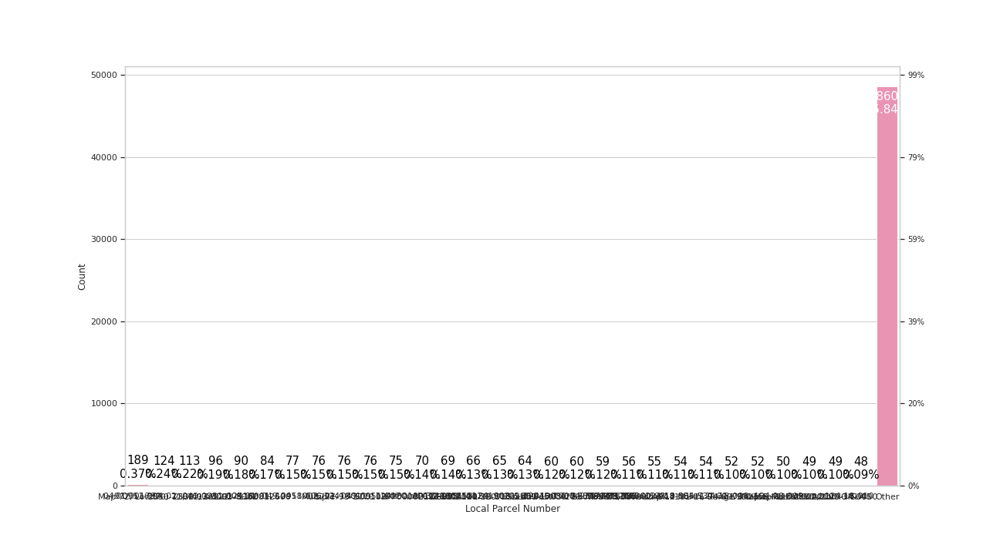
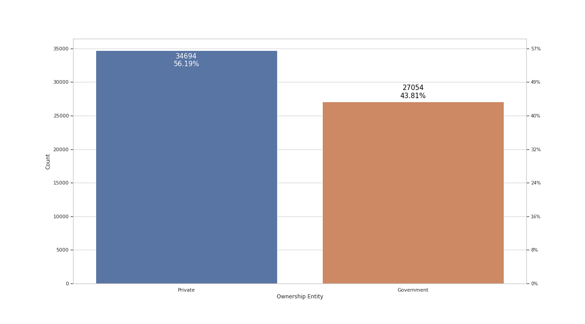
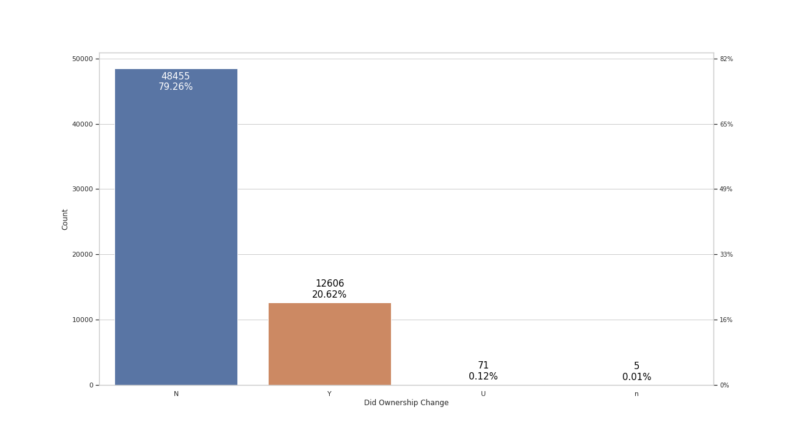
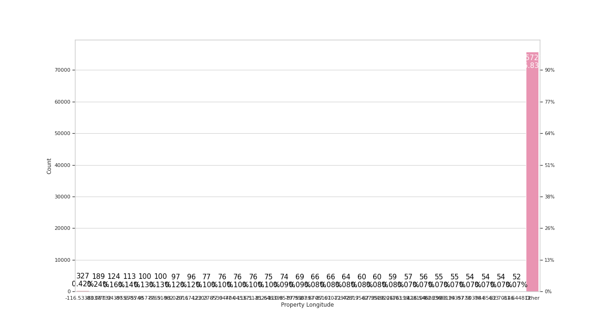

# Dataset Summary

**Number of Observations**: 78527

**Number of Variables**: 21

# Missing Data

# Grant Recipient Name

**Intedact Data Type**: discrete

**Variable Description**: N/A

# Accomplishment Counted

**Intedact Data Type**: discrete

**Variable Description**: N/A

# Cooperative Agreement Number

**Intedact Data Type**: discrete

**Variable Description**: N/A

# Type of Brownfields Grant

**Intedact Data Type**: discrete

**Variable Description**: type of Brownfields Grant

# ACRES Property ID

**Intedact Data Type**: continuous

**Variable Description**: N/A

# Property Name

**Intedact Data Type**: discrete

**Variable Description**: N/A

# Property Address 1

**Intedact Data Type**: discrete

**Variable Description**: N/A

# Property City

**Intedact Data Type**: discrete

**Variable Description**: N/A

# Property  State

**Intedact Data Type**: discrete

**Variable Description**: N/A

# Property Zip Code

**Intedact Data Type**: discrete

**Variable Description**: N/A

# IC Data Address

**Intedact Data Type**: discrete

**Variable Description**: N/A

# Redev Completion Date

**Intedact Data Type**: discrete

**Variable Description**: N/A

# Property Size

**Intedact Data Type**: continuous

**Variable Description**: N/A

# Local Parcel Number

**Intedact Data Type**: discrete

**Variable Description**: N/A

# Ownership Entity

**Intedact Data Type**: discrete

**Variable Description**: N/A

# Current Owner

**Intedact Data Type**: discrete

**Variable Description**: N/A

# Did Ownership Change

**Intedact Data Type**: discrete

**Variable Description**: N/A

# SFLLP fact into the ownership

**Intedact Data Type**: discrete

**Variable Description**: N/A

# Property Latitude

**Intedact Data Type**: discrete

**Variable Description**: N/A

# Property Longitude

**Intedact Data Type**: discrete

**Variable Description**: N/A

# Assessment Start Date

**Intedact Data Type**: datetime

**Variable Description**: Amount of Assessment Funding.

