# Brownsfields EDA Summary

* [Dataset Summary](#dataset-summary)
* [Missing Data](#missing-data)
    * [Missing Data Matrix](#missing-data-matrix)
    * [Missing Data Barplot](#missing-data-barplot)
    * [Missing Data Heatmap](#missing-data-heatmap)
* [Univariate Summaries](#univariate-summaries)
    * [Grant Recipient Name](#Grant-Recipient-Name)
    * [Accomplishment Counted](#Accomplishment-Counted)
    * [Cooperative Agreement Number](#Cooperative-Agreement-Number)
    * [Type of Brownfields Grant](#Type-of-Brownfields-Grant)
    * [ACRES Property ID](#ACRES-Property-ID)
    * [Property Name](#Property-Name)
    * [Property Address 1](#Property-Address-1)
    * [Property City](#Property-City)
    * [Property  State](#Property--State)
    * [Property Zip Code](#Property-Zip-Code)
    * [Assessment Start Date](#Assessment-Start-Date)

# Dataset Summary

Dataset summary

**Number of Observations**: 78527

**Number of Variables**: 11

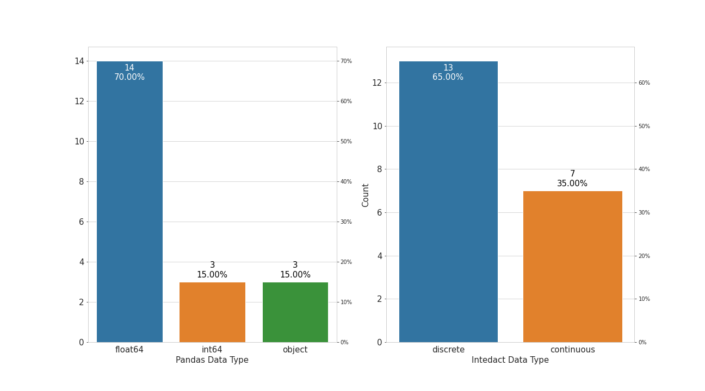

# Missing Data

## Missing Data Matrix

hello1

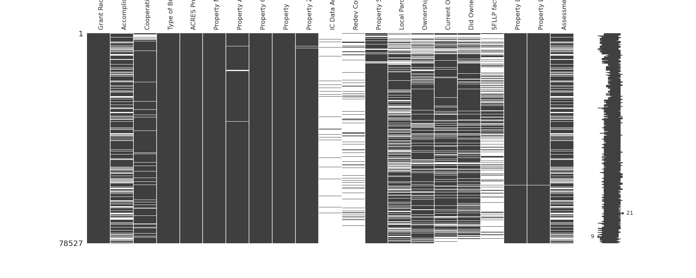

## Missing Data Barplot

hello2

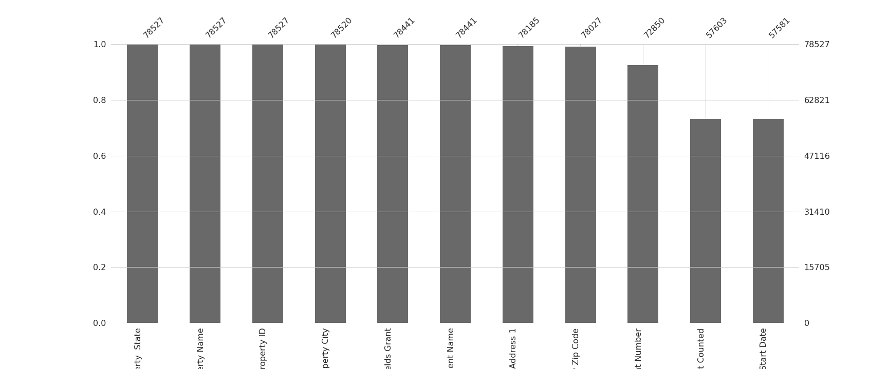

## Missing Data Heatmap

hello3

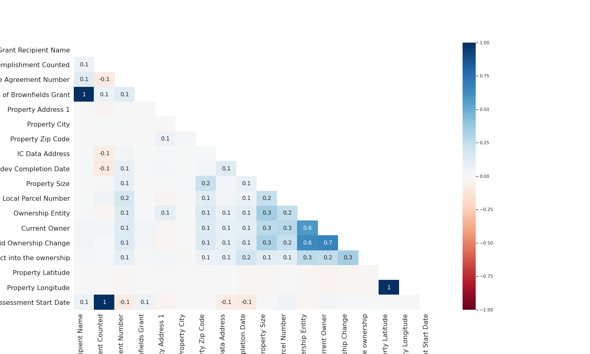

# Univariate Summaries

# Grant Recipient Name

**Intedact Data Type**: discrete

**Variable Description**: N/A

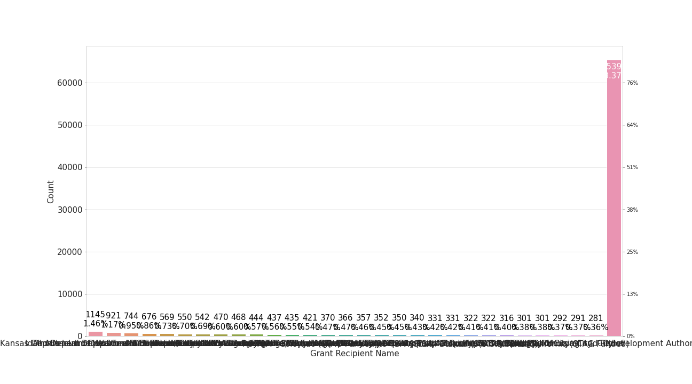

# Accomplishment Counted

**Intedact Data Type**: discrete

**Variable Description**: N/A

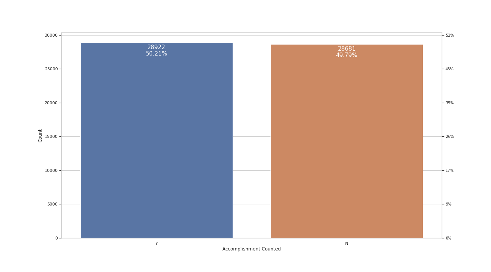

# Cooperative Agreement Number

**Intedact Data Type**: discrete

**Variable Description**: N/A

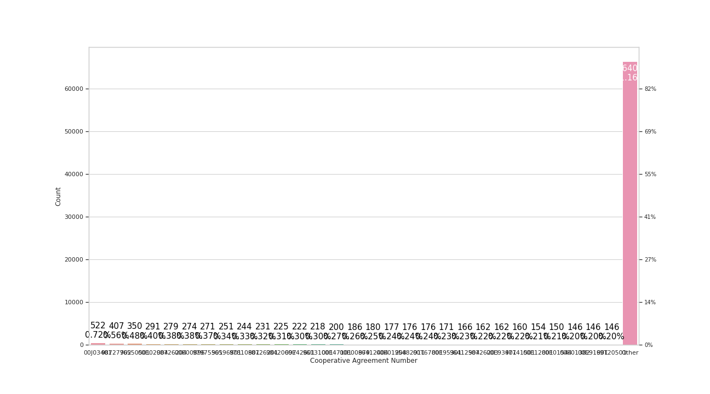

# Type of Brownfields Grant

**Intedact Data Type**: discrete

**Variable Description**: N/A

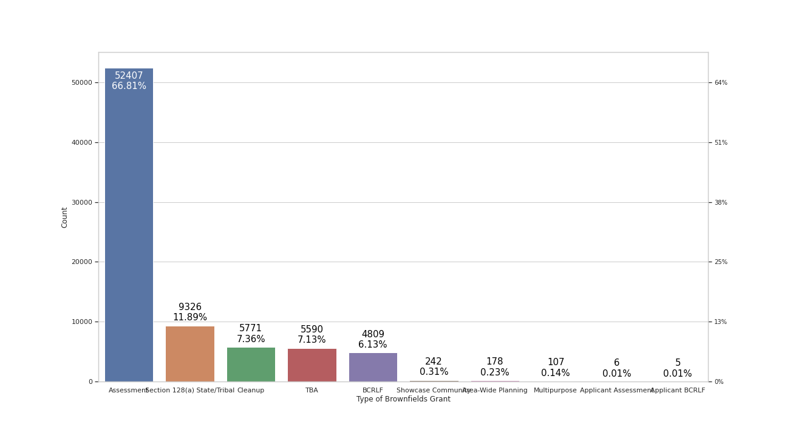

# ACRES Property ID

**Intedact Data Type**: continuous

**Variable Description**: N/A

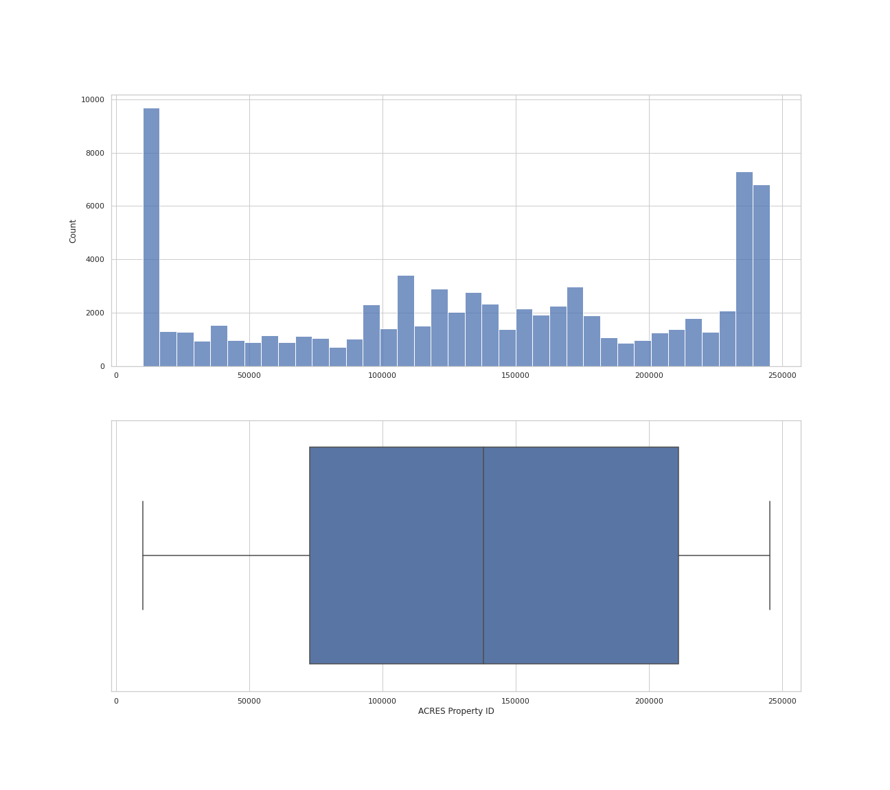

# Property Name

**Intedact Data Type**: discrete

**Variable Description**: N/A

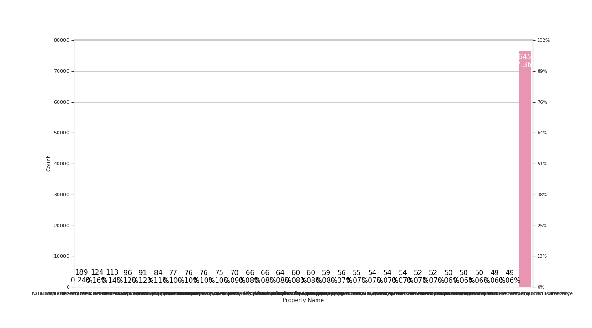

# Property Address 1

**Intedact Data Type**: discrete

**Variable Description**: N/A

# Property City

**Intedact Data Type**: discrete

**Variable Description**: N/A

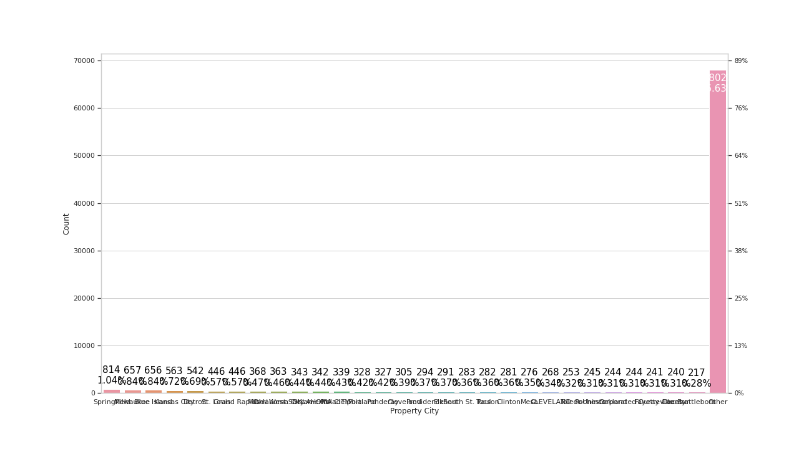

# Property  State

**Intedact Data Type**: discrete

**Variable Description**: N/A

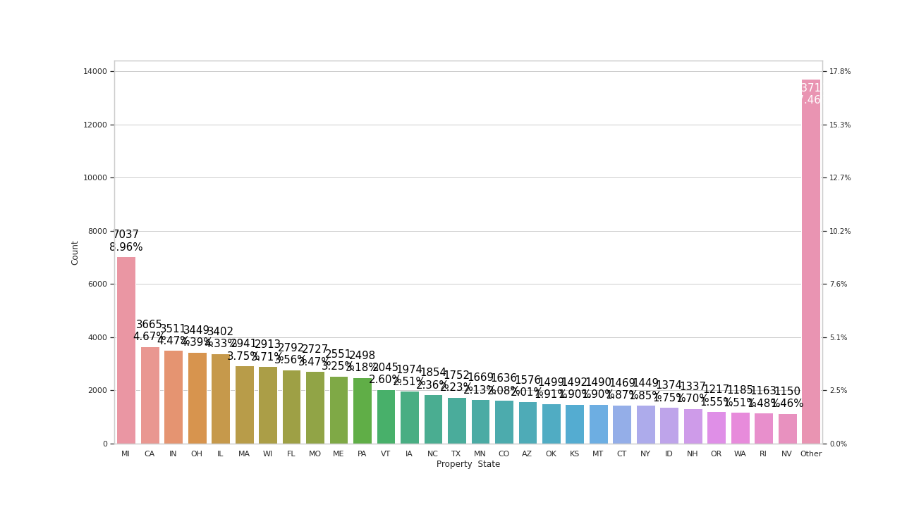

# Property Zip Code

**Intedact Data Type**: discrete

**Variable Description**: N/A

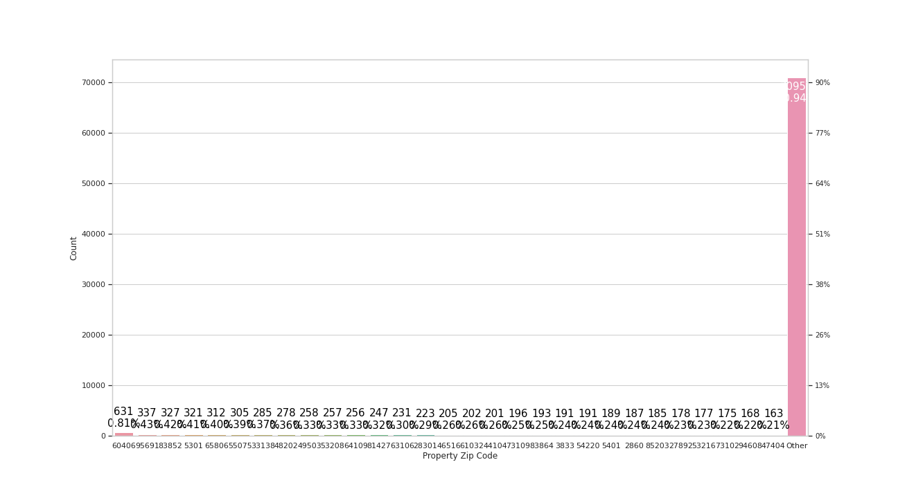

# Assessment Start Date

**Intedact Data Type**: datetime

**Variable Description**: N/A

