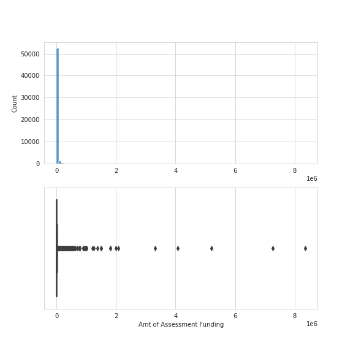

# Brownsfields EDA Summary
    
    Summary text here
    
# Amt of Assessment Funding
Data Type: continuous
Column Description: Blah Blah Blah

# Assessment Start Date
Data Type: datetime
Column Description: Blah Blah Blah

# Type of Brownfields Grant
Data Type: discrete
Column Description: Blah Blah Blah

