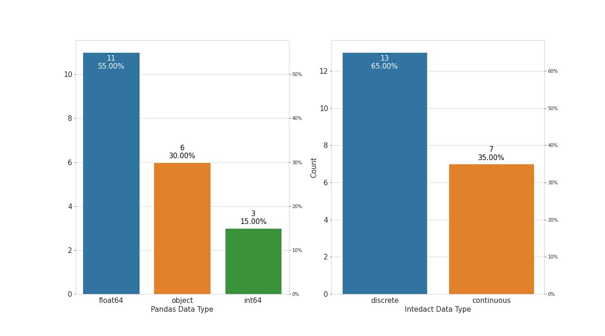
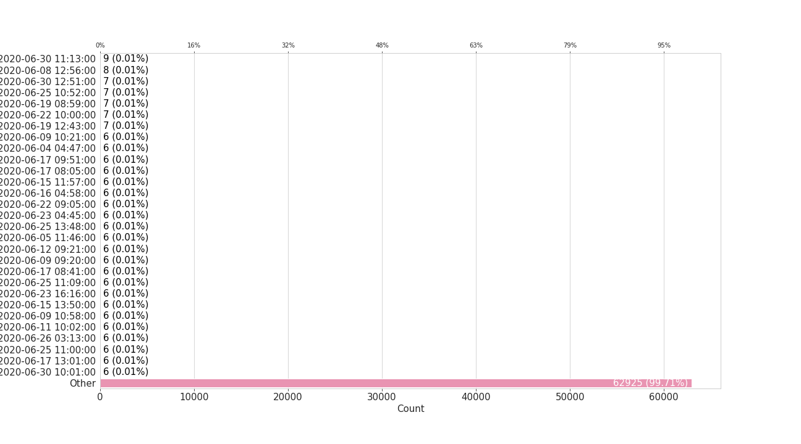
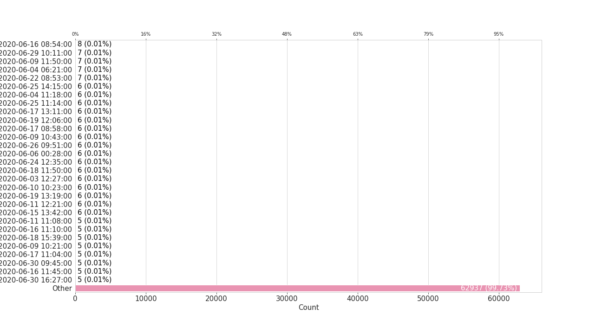
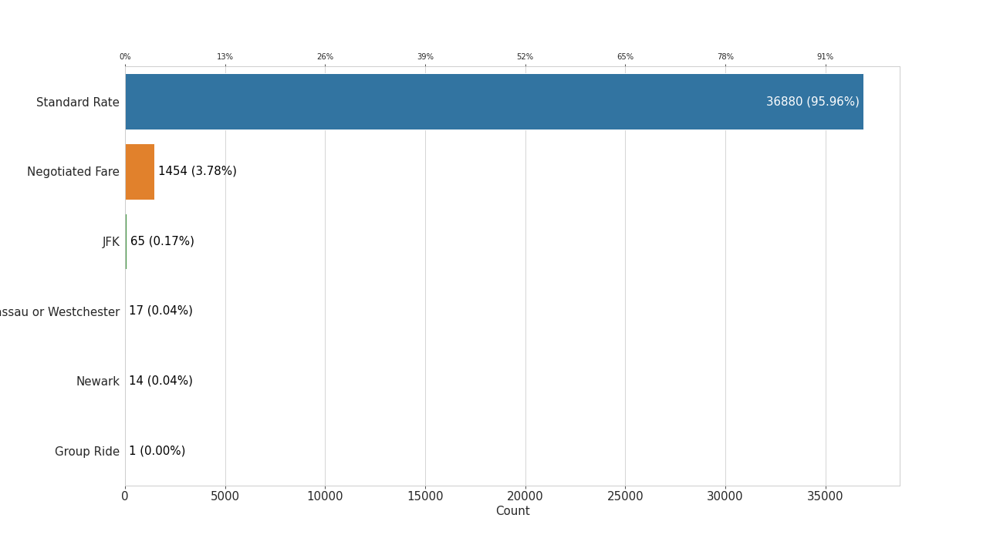
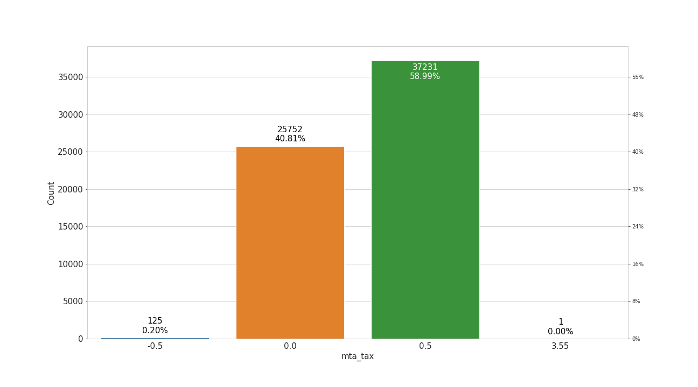
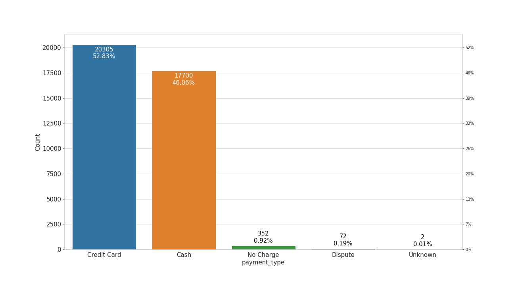
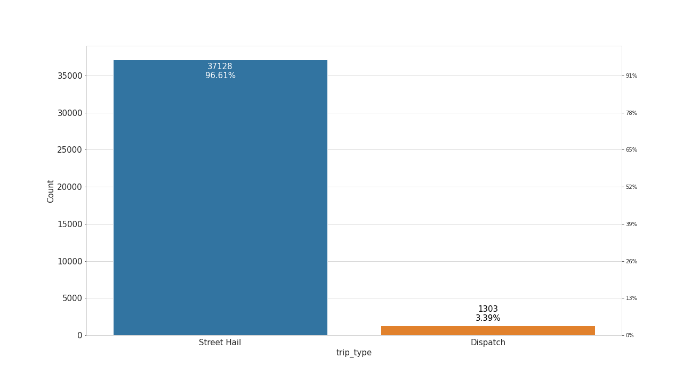

# NYC Green Taxi Trips EDA Summary

* [Dataset Summary](#dataset-summary)
* [Unit of Observation](#unit-of-observation)
* [Columns Summary](#columns-summary)
* [Data Types Summary](#data-types-summary)
* [Missing Data](#missing-data)
* [Univariate Summaries](#univariate-summaries)
    * [VendorID](#VendorID)
    * [lpep_pickup_datetime](#lpep_pickup_datetime)
    * [lpep_dropoff_datetime](#lpep_dropoff_datetime)
    * [store_and_fwd_flag](#store_and_fwd_flag)
    * [RatecodeID](#RatecodeID)
    * [PULocationID](#PULocationID)
    * [DOLocationID](#DOLocationID)
    * [passenger_count](#passenger_count)
    * [trip_distance](#trip_distance)
    * [fare_amount](#fare_amount)
    * [extra](#extra)
    * [mta_tax](#mta_tax)
    * [tip_amount](#tip_amount)
    * [tolls_amount](#tolls_amount)
    * [improvement_surcharge](#improvement_surcharge)
    * [total_amount](#total_amount)
    * [payment_type](#payment_type)
    * [trip_type](#trip_type)
    * [congestion_surcharge](#congestion_surcharge)
    * [id](#id)

# Dataset Summary

This is a dataset containing information on NYC green taxi trips in June of 2020.

|   Number of Rows |   Number of Unique Rows |   Number of Columns | Memory Usage   |
|-----------------:|------------------------:|--------------------:|:---------------|
|            63109 |                   63109 |                  20 | 28.5 MB        |

# Unit of Observation

Each row represents a single taxi trip.

The following column combinations serve as unique identifiers for the data:

* id

# Columns Summary

| Column                | Column Description                                                                                                                                                                                  | Intedact Data Type   | Pandas Data Type   | Memory Usage   |
|:----------------------|:----------------------------------------------------------------------------------------------------------------------------------------------------------------------------------------------------|:---------------------|:-------------------|:---------------|
| VendorID              | A code indicating the LPEP provider that provided the record. (1 = Creative Mobile Technologies, LLC,  2 = VeriFone Inc.)                                                                           | discrete             | float64            | 505.0 KB       |
| lpep_pickup_datetime  | The date and time when the meter was engaged.                                                                                                                                                       | discrete             | object             | 4.8 MB         |
| lpep_dropoff_datetime | The date and time when the meter was disengaged.                                                                                                                                                    | discrete             | object             | 4.8 MB         |
| store_and_fwd_flag    | This flag indicates whether the trip record was held in vehicle memory before sending to the vendor, aka “store and forward,” because the vehicle did not have a connection to the server.          | discrete             | object             | 3.0 MB         |
| RatecodeID            | The final rate code in effect at the end of the trip. (1 = Standard rate,  2 = JFK,  3 = Newark,  4 = Nassau or Westchester,  5 = Negotiated fare,  6 = Group ride)                                 | discrete             | object             | 3.5 MB         |
| PULocationID          | TLC Taxi Zone in which the taximeter was engaged                                                                                                                                                    | continuous           | int64              | 505.0 KB       |
| DOLocationID          | TLC Taxi Zone in which the taximeter was disengaged                                                                                                                                                 | continuous           | int64              | 505.0 KB       |
| passenger_count       | The number of passengers in the vehicle. This is a driver-entered value.                                                                                                                            | discrete             | float64            | 505.0 KB       |
| trip_distance         | The elapsed trip distance in miles reported by the taximeter.                                                                                                                                       | continuous           | float64            | 505.0 KB       |
| fare_amount           | The time-and-distance fare calculated by the meter                                                                                                                                                  | continuous           | float64            | 505.0 KB       |
| extra                 | Miscellaneous extras and surcharges.  Currently, this only includes the$0.50 and $1 rush hour and overnight charges.                                                                                | discrete             | float64            | 505.0 KB       |
| mta_tax               | $0.50 MTA tax that is automatically triggered based on the metered rate in use.                                                                                                                     | discrete             | float64            | 505.0 KB       |
| tip_amount            | Tip amount –This field is automatically populated for credit card tips. Cash tips are not included.                                                                                                 | continuous           | float64            | 505.0 KB       |
| tolls_amount          | Total amount of all tolls paid in trip.                                                                                                                                                             | discrete             | float64            | 505.0 KB       |
| improvement_surcharge | $0.30 improvement surcharge assessed on hailed trips at the flag drop. The improvement surcharge began being levied in 2015.                                                                        | discrete             | float64            | 505.0 KB       |
| total_amount          | The total amount charged to passengers. Does not include cash tips.                                                                                                                                 | continuous           | float64            | 505.0 KB       |
| payment_type          | A  numeric code signifying how the passenger paid for the trip. (1 = Credit card,  2 = Cash,  3 = No charge,  4 = Dispute,  5 = Unknown,  6 = Voided trip)                                          | discrete             | object             | 3.3 MB         |
| trip_type             | A code indicating whether the tripwas a street-hail or a dispatchthat is automatically assigned based on the metered rate in use but can be altered by the driver. (1 = Street-hail,  2 = Dispatch) | discrete             | object             | 3.4 MB         |
| congestion_surcharge  | N/A                                                                                                                                                                                                 | discrete             | float64            | 505.0 KB       |
| id                    | N/A                                                                                                                                                                                                 | continuous           | int64              | 505.0 KB       |

# Data Types Summary

# Missing Data

# Univariate Summaries

## VendorID

**Intedact Data Type**: discrete

**Pandas Data Type**: float64

**Column Description**: A code indicating the LPEP provider that provided the record. (1 = Creative Mobile Technologies, LLC,  2 = VeriFone Inc.)

Nearly half are missing vendor ids. The data is very imbalanced in favor of vendor 2 (80% of observations).

|   count_observed |   count_unique |   count_missing |   percent_missing |
|-----------------:|---------------:|----------------:|------------------:|
|            38431 |              2 |           24678 |           39.1038 |)

## lpep_pickup_datetime

**Intedact Data Type**: discrete

**Pandas Data Type**: object

**Column Description**: The date and time when the meter was engaged.

|   count_observed |   count_unique |   count_missing |   percent_missing |
|-----------------:|---------------:|----------------:|------------------:|
|            63109 |          54347 |               0 |                 0 |)

## lpep_dropoff_datetime

**Intedact Data Type**: discrete

**Pandas Data Type**: object

**Column Description**: The date and time when the meter was disengaged.

|   count_observed |   count_unique |   count_missing |   percent_missing |
|-----------------:|---------------:|----------------:|------------------:|
|            63109 |          54584 |               0 |                 0 |)

## store_and_fwd_flag

**Intedact Data Type**: discrete

**Pandas Data Type**: object

**Column Description**: This flag indicates whether the trip record was held in vehicle memory before sending to the vendor, aka “store and forward,” because the vehicle did not have a connection to the server.

|   count_observed |   count_unique |   count_missing |   percent_missing |
|-----------------:|---------------:|----------------:|------------------:|
|            38431 |              2 |           24678 |           39.1038 |)

## RatecodeID

**Intedact Data Type**: discrete

**Pandas Data Type**: object

**Column Description**: The final rate code in effect at the end of the trip. (1 = Standard rate,  2 = JFK,  3 = Newark,  4 = Nassau or Westchester,  5 = Negotiated fare,  6 = Group ride)

|   count_observed |   count_unique |   count_missing |   percent_missing |
|-----------------:|---------------:|----------------:|------------------:|
|            38431 |              6 |           24678 |           39.1038 |)

## PULocationID

**Intedact Data Type**: continuous

**Pandas Data Type**: int64

**Column Description**: TLC Taxi Zone in which the taximeter was engaged

|   count_observed |   count_unique |   count_missing |   percent_missing |   min |   25% |   50% |    mean |   75% |   max |     std |   iqr |
|-----------------:|---------------:|----------------:|------------------:|------:|------:|------:|--------:|------:|------:|--------:|------:|
|            63109 |            250 |               0 |                 0 |     3 |    52 |    75 | 107.797 |   166 |   265 | 70.1656 |   114 |)

## DOLocationID

**Intedact Data Type**: continuous

**Pandas Data Type**: int64

**Column Description**: TLC Taxi Zone in which the taximeter was disengaged

|   count_observed |   count_unique |   count_missing |   percent_missing |   min |   25% |   50% |    mean |   75% |   max |   std |   iqr |
|-----------------:|---------------:|----------------:|------------------:|------:|------:|------:|--------:|------:|------:|------:|------:|
|            63109 |            258 |               0 |                 0 |     1 |    61 |   117 | 126.781 |   190 |   265 | 76.24 |   129 |)

## passenger_count

**Intedact Data Type**: discrete

**Pandas Data Type**: float64

**Column Description**: The number of passengers in the vehicle. This is a driver-entered value.

|   count_observed |   count_unique |   count_missing |   percent_missing |
|-----------------:|---------------:|----------------:|------------------:|
|            38431 |             10 |           24678 |           39.1038 |)

## trip_distance

**Intedact Data Type**: continuous

**Pandas Data Type**: float64

**Column Description**: The elapsed trip distance in miles reported by the taximeter.

|   count_observed |   count_unique |   count_missing |   percent_missing |   min |   25% |   50% |   mean |   75% |    max |     std |   iqr |
|-----------------:|---------------:|----------------:|------------------:|------:|------:|------:|-------:|------:|-------:|--------:|------:|
|            63109 |           2955 |               0 |                 0 |     0 |  1.25 |  2.66 | 45.843 |  6.34 | 162292 | 2184.13 |  5.09 |)

## fare_amount

**Intedact Data Type**: continuous

**Pandas Data Type**: float64

**Column Description**: The time-and-distance fare calculated by the meter

|   count_observed |   count_unique |   count_missing |   percent_missing |   min |   25% |   50% |    mean |   75% |   max |     std |   iqr |
|-----------------:|---------------:|----------------:|------------------:|------:|------:|------:|--------:|------:|------:|--------:|------:|
|            63109 |           4822 |               0 |                 0 |  -200 |     8 |  14.2 | 19.5774 | 25.28 | 335.5 | 16.3256 | 17.28 |)

## extra

**Intedact Data Type**: discrete

**Pandas Data Type**: float64

**Column Description**: Miscellaneous extras and surcharges.  Currently, this only includes the$0.50 and $1 rush hour and overnight charges.

|   count_observed |   count_unique |   count_missing |   percent_missing |
|-----------------:|---------------:|----------------:|------------------:|
|            63109 |             12 |               0 |                 0 |)

## mta_tax

**Intedact Data Type**: discrete

**Pandas Data Type**: float64

**Column Description**: $0.50 MTA tax that is automatically triggered based on the metered rate in use.

|   count_observed |   count_unique |   count_missing |   percent_missing |
|-----------------:|---------------:|----------------:|------------------:|
|            63109 |              4 |               0 |                 0 |)

## tip_amount

**Intedact Data Type**: continuous

**Pandas Data Type**: float64

**Column Description**: Tip amount –This field is automatically populated for credit card tips. Cash tips are not included.

|   count_observed |   count_unique |   count_missing |   percent_missing |   min |   25% |   50% |    mean |   75% |   max |     std |   iqr |
|-----------------:|---------------:|----------------:|------------------:|------:|------:|------:|--------:|------:|------:|--------:|------:|
|            63109 |            912 |               0 |                 0 | -0.99 |     0 |  1.56 | 1.58011 |  2.75 |   480 | 2.64507 |  2.75 |)

## tolls_amount

**Intedact Data Type**: discrete

**Pandas Data Type**: float64

**Column Description**: Total amount of all tolls paid in trip.

|   count_observed |   count_unique |   count_missing |   percent_missing |
|-----------------:|---------------:|----------------:|------------------:|
|            63109 |             46 |               0 |                 0 |)

## improvement_surcharge

**Intedact Data Type**: discrete

**Pandas Data Type**: float64

**Column Description**: $0.30 improvement surcharge assessed on hailed trips at the flag drop. The improvement surcharge began being levied in 2015.

|   count_observed |   count_unique |   count_missing |   percent_missing |
|-----------------:|---------------:|----------------:|------------------:|
|            63109 |              3 |               0 |                 0 |)

## total_amount

**Intedact Data Type**: continuous

**Pandas Data Type**: float64

**Column Description**: The total amount charged to passengers. Does not include cash tips.

|   count_observed |   count_unique |   count_missing |   percent_missing |    min |   25% |   50% |    mean |   75% |   max |     std |   iqr |
|-----------------:|---------------:|----------------:|------------------:|-------:|------:|------:|--------:|------:|------:|--------:|------:|
|            63109 |           5452 |               0 |                 0 | -200.3 |  10.3 | 17.55 | 22.9887 | 29.24 | 498.8 | 17.9916 | 18.94 |)

## payment_type

**Intedact Data Type**: discrete

**Pandas Data Type**: object

**Column Description**: A  numeric code signifying how the passenger paid for the trip. (1 = Credit card,  2 = Cash,  3 = No charge,  4 = Dispute,  5 = Unknown,  6 = Voided trip)

|   count_observed |   count_unique |   count_missing |   percent_missing |
|-----------------:|---------------:|----------------:|------------------:|
|            38431 |              5 |           24678 |           39.1038 |)

## trip_type

**Intedact Data Type**: discrete

**Pandas Data Type**: object

**Column Description**: A code indicating whether the tripwas a street-hail or a dispatchthat is automatically assigned based on the metered rate in use but can be altered by the driver. (1 = Street-hail,  2 = Dispatch)

|   count_observed |   count_unique |   count_missing |   percent_missing |
|-----------------:|---------------:|----------------:|------------------:|
|            38431 |              2 |           24678 |           39.1038 |)

## congestion_surcharge

**Intedact Data Type**: discrete

**Pandas Data Type**: float64

**Column Description**: N/A

|   count_observed |   count_unique |   count_missing |   percent_missing |
|-----------------:|---------------:|----------------:|------------------:|
|            38431 |              3 |           24678 |           39.1038 |)

## id

**Intedact Data Type**: continuous

**Pandas Data Type**: int64

**Column Description**: N/A

|   count_observed |   count_unique |   count_missing |   percent_missing |   min |   25% |   50% |   mean |   75% |   max |     std |   iqr |
|-----------------:|---------------:|----------------:|------------------:|------:|------:|------:|-------:|------:|------:|--------:|------:|
|            63109 |          63109 |               0 |                 0 |     0 | 15777 | 31554 |  31554 | 47331 | 63108 | 18218.1 | 31554 |)

BOOM!!